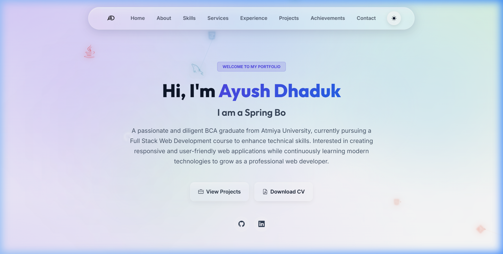
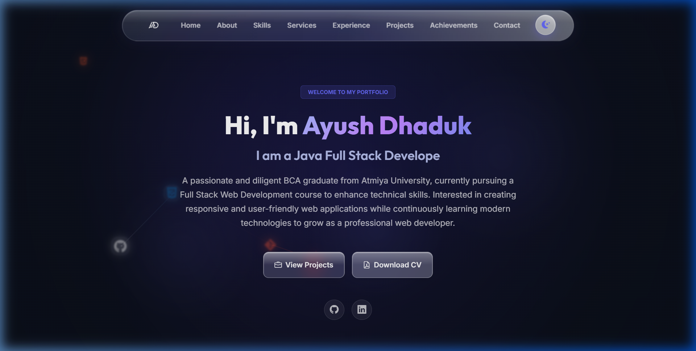

# Modern Developer Portfolio — Ayush Dhaduk

A premium, fully responsive, static developer portfolio built for **Ayush Dhaduk | Java Full Stack Developer**. The application showcases projects, skills, professional experience, and achievements using a highly interactive and modern **glassmorphism design** with dynamic theme toggling.

---

## 📸 Previews

### Light Mode


### Dark Mode


---

## ✨ Features

- **Premium Glassmorphism Aesthetic**: Vibrant fluid backdrop glow bubbles, custom scroll indicator, and subtle hover animations.
- **Dynamic Theme Mode Switcher**: Supports seamless switching between light and dark mode themes, complete with smooth icon transitions and auto-adjusting SVG logo visibility.
- **Comprehensive Sections**:
  - **About & Profile Card**: Introduces key developer information and links to active social pages.
  - **Tech Stack**: Displays core technologies (Java, Spring Boot, SQL, AWS, Javascript, CSS) with interactive icons.
  - **Experience & Journey Map**: Chronological interactive timeline showcasing professional experiences.
  - **Project Showcase**: Displays highlight projects (Foody, Microservice system, Gemini Chatbot, etc.) with custom Bootstrap glass modal details.
  - **Contact & Simulated Forms**: Fully responsive contact form with field validations and a CV download action link.
- **Fully Responsive Layout**: Built with a custom mobile overlay drawer and Bootstrap Grid for seamless styling on desktop, tablet, and mobile.

---

## 🛠️ Technology Stack

- **Structure & Layout**: [HTML5](https://developer.mozilla.org/en-US/docs/Web/HTML), [Bootstrap 5](https://getbootstrap.com/)
- **Styling & Effects**: [Vanilla CSS3](https://developer.mozilla.org/en-US/docs/Web/CSS) (Custom design tokens, glassmorphism filters, theme variables, fluid glow animation)
- **Interactivity**: [Vanilla JavaScript (ES6+)](https://developer.mozilla.org/en-US/docs/Web/JavaScript)
- **Icons & Typography**: [Bootstrap Icons](https://icons.getbootstrap.com/), [FontAwesome](https://fontawesome.com/), [Devicon CDNs](https://devicon.dev/), [Google Fonts (Inter / Outfit)](https://fonts.google.com/)

---

## 🚀 Running Locally

To run the portfolio website locally, follow these simple steps:

1. **Clone the Repository**:
   ```bash
   git clone https://github.com/Ayushdhaduk/portfolio.git
   cd portfolio
   ```

2. **Open index.html**:
   - Double-click `index.html` to open it in your browser directly, or
   - Serve it using a local developer web server (e.g. Python):
     ```bash
     python -m http.server 8000
     ```
     Then navigate to `http://localhost:8000` in your web browser.
